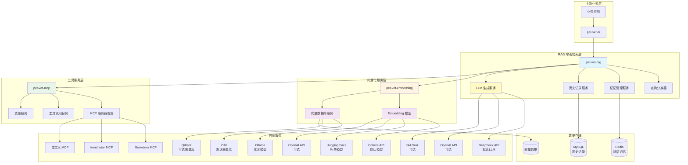
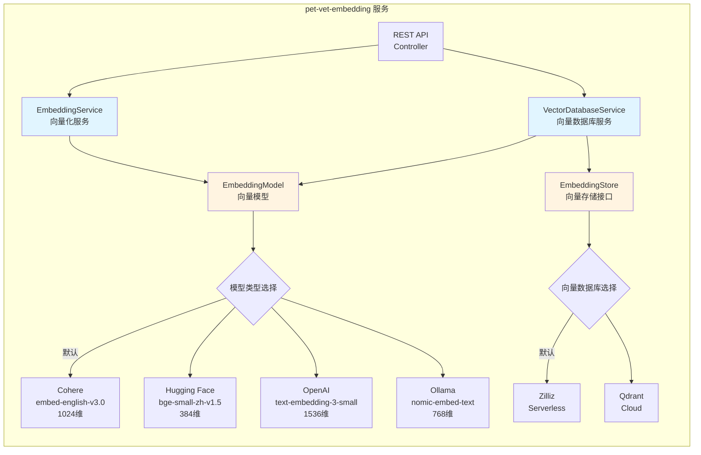
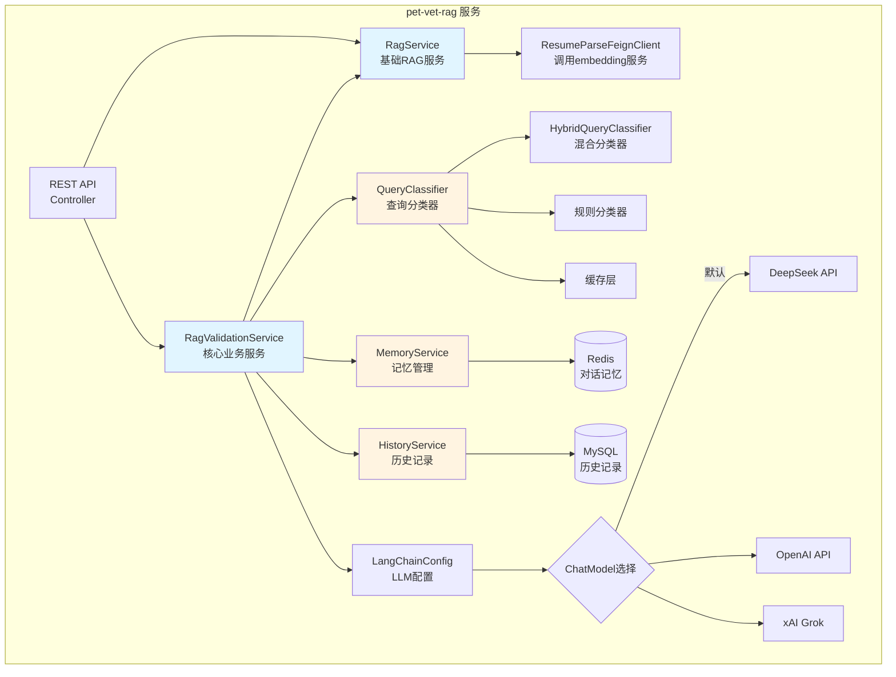
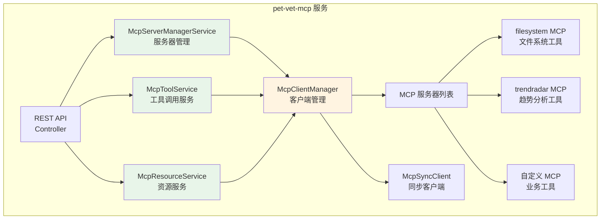
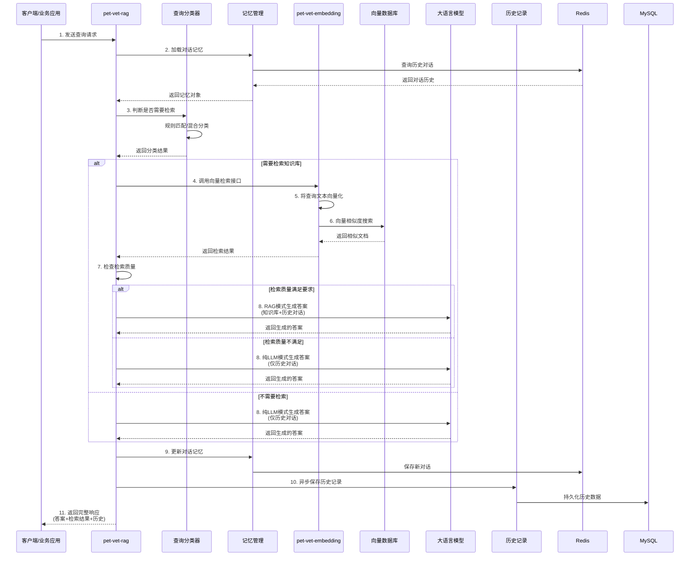
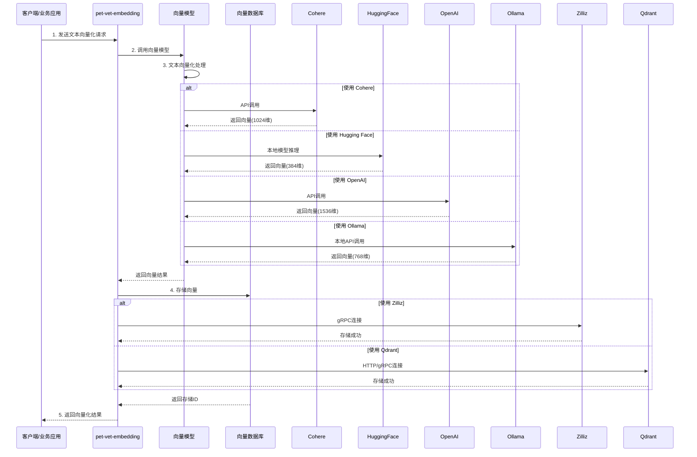
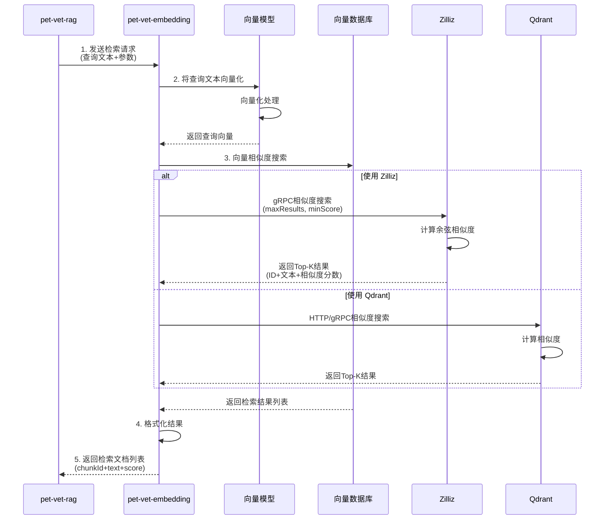
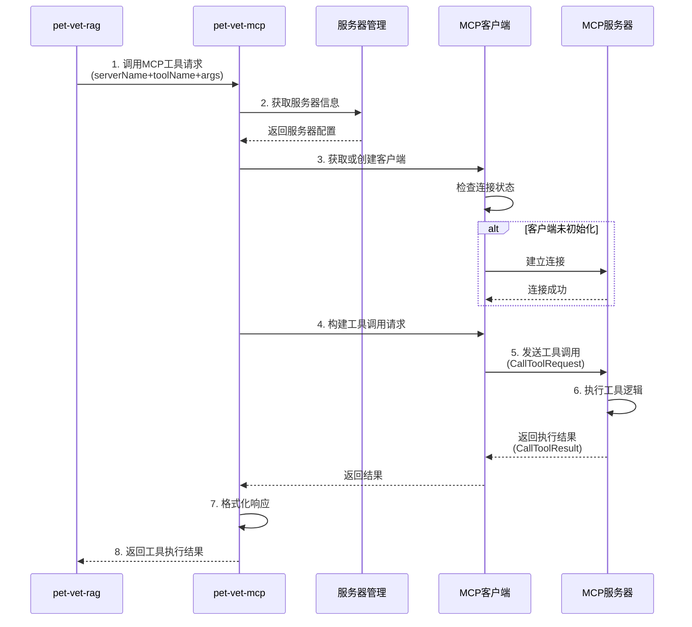
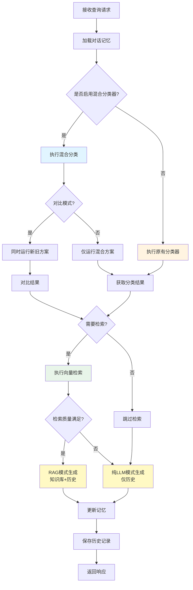

# PetVet 服务架构设计文档

## 1. 系统架构图

### 1.1 整体架构

### 1.2 服务详细架构

#### 1.2.1 pet-vet-embedding 服务架构

**关键组件说明：**

- **EmbeddingService**: 负责文本向量化，支持单文本和批量向量化
- **VectorDatabaseService**: 负责向量存储和检索，提供相似度搜索功能
- **EmbeddingModel**: 向量模型抽象，支持多种模型提供商
- **EmbeddingStore**: 向量存储抽象，支持多种向量数据库

**支持的向量模型：**
- **Cohere** (默认): `embed-english-v3.0` (1024维) - 有免费额度，性能好
- **Hugging Face**: `BAAI/bge-small-zh-v1.5` (384维) - 完全免费，推荐中文场景
- **OpenAI**: `text-embedding-3-small` (1536维) - 需要 API Key，性能优秀
- **Ollama**: `nomic-embed-text` (768维) - 完全免费，本地运行

**支持的向量数据库：**
- **Zilliz** (默认): Serverless 云服务，支持 TLS 连接
- **Qdrant**: Cloud 云服务，可作为备选方案

#### 1.2.2 pet-vet-rag 服务架构

**关键组件说明：**

- **RagValidationService**: 核心业务服务，整合检索、生成、记忆管理等功能
- **RagService**: 基础 RAG 服务，提供检索和生成能力
- **QueryClassifier**: 查询分类器，判断是否需要检索知识库
- **MemoryService**: 对话记忆管理，维护用户会话上下文
- **HistoryService**: 历史记录管理，持久化查询历史
- **LangChainConfig**: LLM 配置管理，支持多种大模型

**支持的 LLM 模型：**
- **DeepSeek** (默认): `deepseek-chat` - 价格便宜，国内访问稳定
- **OpenAI**: `gpt-4o` - 性能优秀，需要 API Key
- **xAI Grok**: `grok-4-latest` - 性能优秀，使用 OpenAI 兼容 API

#### 1.2.3 pet-vet-mcp 服务架构

**关键组件说明：**

- **McpServerManagerService**: MCP 服务器注册和管理
- **McpToolService**: MCP 工具调用服务，支持调用各种 MCP 工具
- **McpResourceService**: MCP 资源服务，支持获取 MCP 资源
- **McpClientManager**: MCP 客户端管理，维护与 MCP 服务器的连接

**已配置的 MCP 服务器：**
- **filesystem**: 文件系统操作工具（开源）
- **trendradar**: 趋势分析工具（开源）
- **自定义 MCP**: 可扩展的业务工具

## 2. 数据交互流程图

### 2.1 RAG 查询完整流程

### 2.2 向量化存储流程

### 2.3 向量检索流程

### 2.4 MCP 工具调用流程

### 2.5 查询分类决策流程

## 3. 技术栈说明

### 3.1 pet-vet-embedding 服务

| 组件 | 技术选型 | 说明 |
|------|---------|------|
| 向量模型 | Cohere (默认) | embed-english-v3.0, 1024维 |
| 向量模型 | Hugging Face | BAAI/bge-small-zh-v1.5, 384维 |
| 向量模型 | OpenAI | text-embedding-3-small, 1536维 |
| 向量模型 | Ollama | nomic-embed-text, 768维 |
| 向量数据库 | Zilliz (默认) | Serverless 云服务 |
| 向量数据库 | Qdrant | Cloud 云服务 |
| 框架 | Spring Boot | Java 微服务框架 |
| 向量化库 | LangChain4j | Java 向量化库 |

### 3.2 pet-vet-rag 服务

| 组件 | 技术选型 | 说明 |
|------|---------|------|
| LLM 模型 | DeepSeek (默认) | deepseek-chat, 价格便宜 |
| LLM 模型 | OpenAI | gpt-4o, 性能优秀 |
| LLM 模型 | xAI Grok | grok-4-latest, 性能优秀 |
| 服务调用 | Feign | 调用 embedding 服务 |
| 记忆存储 | Redis | 对话记忆缓存 |
| 历史存储 | MySQL | 历史记录持久化 |
| 框架 | Spring Boot | Java 微服务框架 |
| LLM 库 | LangChain4j | Java LLM 集成库 |

### 3.3 pet-vet-mcp 服务

| 组件 | 技术选型 | 说明 |
|------|---------|------|
| MCP 协议 | Model Context Protocol | 标准 MCP 协议 |
| MCP 客户端 | MCP Java SDK | 官方 Java SDK |
| 框架 | Spring Boot | Java 微服务框架 |
| 工具管理 | 动态注册 | 支持动态注册 MCP 服务器 |

## 4. 数据流转说明

### 4.1 向量化数据流转

1. **文本输入** → EmbeddingService
2. **向量化** → EmbeddingModel (Cohere/Hugging Face/OpenAI/Ollama)
3. **向量存储** → EmbeddingStore (Zilliz/Qdrant)
4. **向量检索** → 相似度搜索 → 返回 Top-K 结果

### 4.2 RAG 数据流转

1. **用户查询** → RagValidationService
2. **记忆加载** → MemoryService → Redis
3. **查询分类** → QueryClassifier → 判断是否需要检索
4. **向量检索** → RagService → EmbeddingService → VectorDB
5. **答案生成** → LLM (DeepSeek/OpenAI/Grok)
6. **记忆更新** → MemoryService → Redis
7. **历史保存** → HistoryService → MySQL

### 4.3 MCP 工具数据流转

1. **工具调用请求** → McpToolService
2. **服务器管理** → McpServerManagerService
3. **客户端连接** → McpClientManager → MCP Server
4. **工具执行** → MCP Server → 返回结果
5. **结果返回** → 格式化响应 → 返回给调用方

## 5. 服务交互接口

### 5.1 pet-vet-embedding 服务接口

- **POST /api/embedding/embed**: 文本向量化
- **POST /api/embedding/search**: 向量相似度搜索
- **POST /api/resume/parse**: 简历解析和向量化
- **POST /api/resume/search**: 简历向量检索

### 5.2 pet-vet-rag 服务接口

- **POST /api/rag/query**: 基础 RAG 查询
- **POST /api/rag/validate**: RAG 验证查询（包含记忆管理）
- **GET /api/rag/health**: 健康检查

### 5.3 pet-vet-mcp 服务接口

- **POST /api/mcp/servers/register**: 注册 MCP 服务器
- **GET /api/mcp/servers**: 获取所有服务器
- **POST /api/mcp/tools/call**: 调用 MCP 工具
- **GET /api/mcp/servers/{serverName}/tools**: 列出服务器工具
- **POST /api/mcp/resources/get**: 获取资源
- **GET /api/mcp/servers/{serverName}/resources**: 列出服务器资源

## 6. 配置说明

### 6.1 向量模型配置

通过环境变量 `EMBEDDING_MODEL_TYPE` 选择模型类型：
- `cohere` (默认)
- `hugging-face`
- `openai`
- `ollama`

### 6.2 向量数据库配置

通过环境变量 `VECTOR_DB_TYPE` 选择数据库类型：
- `zilliz` (默认)
- `qdrant`

### 6.3 LLM 模型配置

通过环境变量 `AI_PROVIDER_TYPE` 选择 LLM 提供商：
- `deepseek` (默认)
- `openai`
- `grok`

## 7. 总结

本架构设计采用分层架构，实现了：

1. **基础服务层 (pet-vet-embedding)**: 提供向量化和向量存储能力，支持多种模型和数据库
2. **增强服务层 (pet-vet-rag)**: 提供 RAG 增强检索，整合知识库和 LLM
3. **工具服务层 (pet-vet-mcp)**: 提供 MCP 工具调用能力，支持扩展

三层服务相互配合，为上层业务提供完整的 AI 能力支持。
